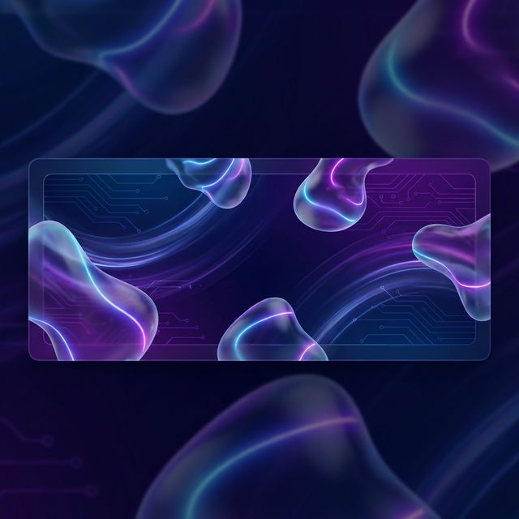

  

<h1 align="center">Hi there, I'm <a href="https://github.com/andysama" target="_blank">Andy</a> </h1>

  <samp>Passionate Full Stack Developer | Creating Digital Experiences with Code</samp>

  

 

##  My Stats

  

   
  

 

##  Tech Stack

  
  
  
  
  
  
  
  
  
   
  
  
  
   
   
  
  

 

##  Contribution Snake

  
  <!-- Note: This requires a GitHub Action setup to generate the snake.svg. I've added a placeholder link assuming standard setup. -->

 

  
  

 

  

